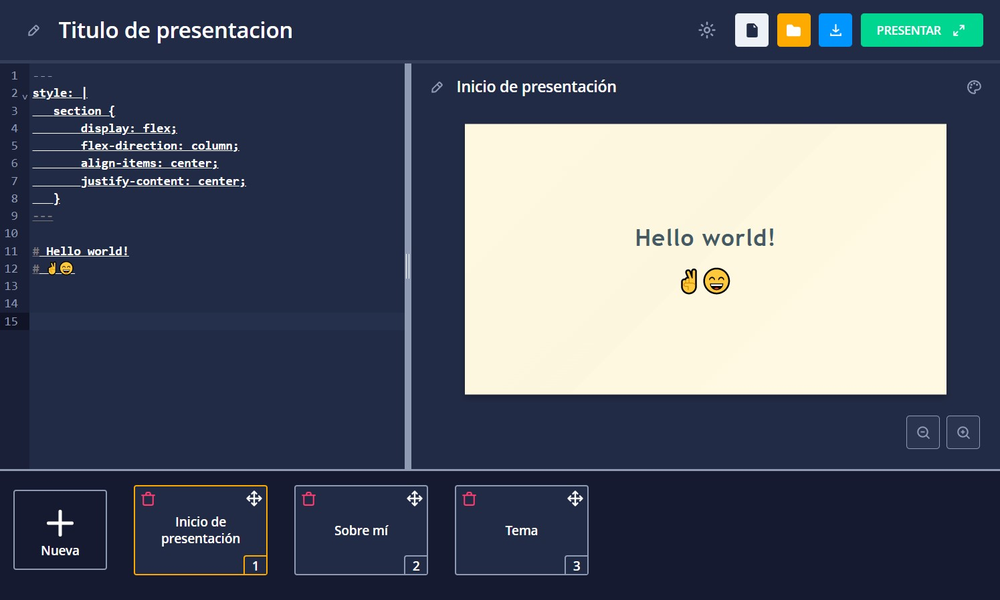

<div align="center">
    <h1>MDSlides </h1>
</div>



MDSlides es una aplicación web para crear presentaciones utilizando Markdown junto con las funcionalidades que ofrece el marcado de [Marpit Framework](https://marpit.marp.app/markdown). Tiene 4 temas disponibles para las presentaciones, una vista de exposición, y se puede descargar la presentación en formato json.

# Tecnologías usadas
## Frameworks y librerías
- [Angular](https://angular.io/)
- [Nebular](https://akveo.github.io/nebular/)
- [Marpit](https://marpit.marp.app/)
- [Codemirror](https://codemirror.net/)

# Getting started
1. Clonar repositorio

```
git clone https://github.com/HDMC3/mdslides.git
```

2. Instalar dependencias

```
cd mdslides
npm install
```

3. Levantar servidor de desarrollo

```
npm run start
```